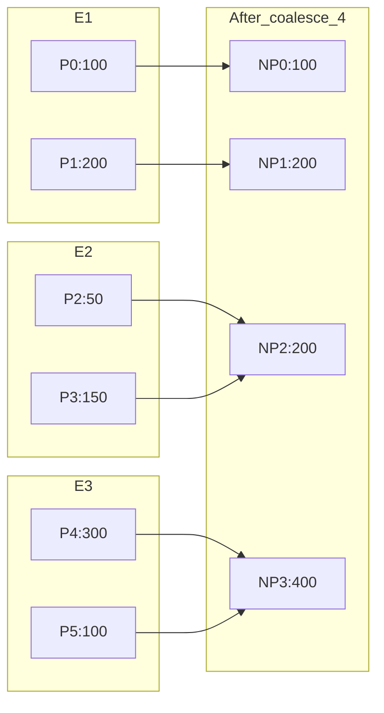
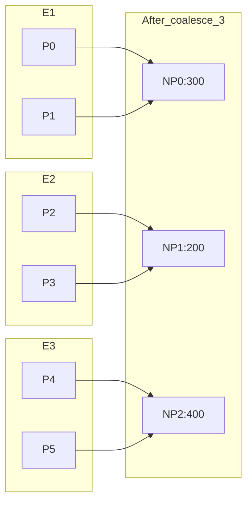
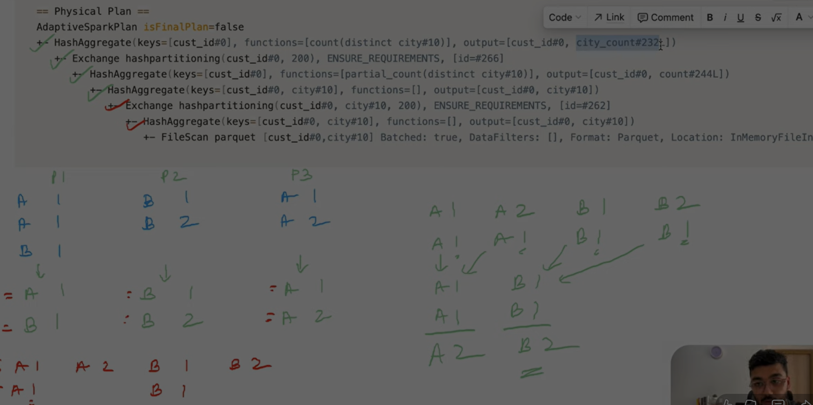

>## what are the basic things how spark works 
like the cluster node,executors all that

Answer:

To understand how Apache Spark works, you need to know its core architecture and components. Spark is a distributed data processing engine, which means it runs your code across multiple machines in a cluster.

--------------------------------------------------

1. High-Level Flow (How Spark Works):

1. You write code (Python / Scala / SQL)
2. Spark converts it into a logical plan
3. Optimizer creates a physical execution plan
4. Tasks are distributed across the cluster
5. Results are collected back

--------------------------------------------------

2. Core Components of Spark Architecture:

a) Driver (Brain of Spark)
- Runs your main program
- Creates SparkSession
- Converts your code into execution plan
- Schedules tasks

Think of it as: "Manager"

--------------------------------------------------

b) Cluster Manager
- Manages resources (CPU, memory)
- Decides where to run tasks

Examples:
- YARN
- Kubernetes
- Standalone

Think of it as: "Resource allocator"

--------------------------------------------------

c) Worker Nodes
- Machines where actual computation happens
- Each node runs executors

Think of it as: "Workers (machines)"

--------------------------------------------------

d) Executors
- Processes running on worker nodes
- Execute tasks
- Store data in memory or disk
- Return results to driver

Think of it as: "Employees doing actual work"

--------------------------------------------------

e) Tasks
- Smallest unit of work
- Each task processes one partition

Example:
10 partitions → 10 tasks

--------------------------------------------------

f) Partitions
- Splits of data
- Each partition is processed independently

--------------------------------------------------

3. How Everything Works Together:

Example flow:

1. You run:
   df.groupBy("city").count()

2. Driver:
   - Creates logical plan
   - Optimizes it
   - Breaks into stages & tasks

3. Cluster Manager:
   - Allocates executors on worker nodes

4. Executors:
   - Receive tasks
   - Process partitions
   - Perform computation

5. Results:
   - Sent back to driver or written to storage

--------------------------------------------------

4. Important Concepts:

a) Lazy Evaluation
- Spark does NOT execute immediately
- It builds a plan and runs only when an action is called

Transformations:
- select, filter, groupBy (lazy)

Actions:
- show(), count(), collect() (trigger execution)

--------------------------------------------------

b) DAG (Directed Acyclic Graph)
- Spark builds a DAG of operations
- Helps optimize execution

--------------------------------------------------

c) Stages & Shuffle
- Stage = group of tasks without data movement
- Shuffle = data transfer between nodes (expensive)

--------------------------------------------------

5. Simple Diagram (Mental Model):

Driver
   ↓
Cluster Manager
   ↓
Worker Nodes
   ↓
Executors
   ↓
Tasks (on partitions)

--------------------------------------------------

6. Why This Architecture Matters:

- Enables parallel processing
- Handles large-scale data
- Provides fault tolerance
- Improves performance using in-memory computation

--------------------------------------------------

7. One-Line Summary:

Spark works by splitting data into partitions, sending tasks to executors across worker nodes, and coordinating everything through the driver for fast, distributed processing.

---

## Reparitioning
>## What is roundrobbinpartitioning in spark

Answer:

Round Robin Partitioning in Apache Spark is a method of distributing data evenly across partitions in a cyclic (one-by-one) manner.

Instead of using a key (like in hash partitioning), Spark assigns rows sequentially to partitions:
- Row 1 → Partition 1
- Row 2 → Partition 2
- Row 3 → Partition 3
- ...
- After last partition → start again from Partition 1

This ensures that data is spread as evenly as possible.

Why it is used:
- To avoid data skew (uneven distribution of data)
- To balance workload across executors
- Useful when there is no natural partitioning key

Where it is used in Spark:
- Internally used in operations like repartition()
- Especially when you call:
  df.repartition(n)

Example:

df.repartition(3)

If your dataset has 9 rows, distribution might look like:
- Partition 1 → rows 1, 4, 7
- Partition 2 → rows 2, 5, 8
- Partition 3 → rows 3, 6, 9

Key Characteristics:
- Even distribution of data
- No guarantee that related data stays together
- Good for parallel processing
- Not suitable when you need grouping by key (use hash partitioning instead)

Difference from Hash Partitioning:
- Round Robin: Distributes rows sequentially (no key)
- Hash Partitioning: Distributes based on hash of a column (same keys go to same partition)

When to use:
- When data is skewed
- When you just want balanced partitions
- When no join/grouping key is required

When NOT to use:
- Before joins or aggregations on a key (because related data will be scattered)

In short:
Round Robin Partitioning = Evenly spreading data across partitions without using any column as a key.

---

>## How is partitioning helpful , where it would be helpful in spark
why should someone use

Answer:

Partitioning in Apache Spark is one of the most important concepts because it directly impacts performance, parallelism, and scalability.

1. What is Partitioning (quick recap):
Partitioning means splitting a large dataset into smaller chunks (partitions), which are processed in parallel across different executors.

--------------------------------------------------

2. Why Partitioning is Helpful:

a) Parallel Processing (BIGGEST advantage)
- Each partition is processed by a separate task.
- More partitions → more parallelism → faster execution.

Example:
If you have 1 partition → only 1 core works  
If you have 10 partitions → up to 10 cores can work in parallel

--------------------------------------------------

b) Better Resource Utilization
- Ensures all CPU cores in the cluster are used efficiently.
- Prevents idle executors.

--------------------------------------------------

c) Handles Big Data Efficiently
- Large datasets don’t fit into one machine.
- Partitioning distributes data across multiple machines.

--------------------------------------------------

d) Avoids Data Skew (when used properly)
- Proper partitioning ensures balanced data across nodes.
- Prevents one executor from doing most of the work.

--------------------------------------------------

e) Improves Fault Tolerance
- If one partition fails, only that partition is recomputed (not entire dataset).

--------------------------------------------------

3. Where Partitioning is Helpful in Spark:

a) Joins
- Spark needs matching keys in same partition.
- Proper partitioning reduces shuffle and speeds up joins.

Example:
df1.join(df2, "user_id")

→ If both are partitioned by user_id, join becomes much faster

--------------------------------------------------

b) Aggregations / Group By
- GROUP BY operations depend on partitioning.

Example:
df.groupBy("city").count()

→ If data is partitioned by city, aggregation is efficient

--------------------------------------------------

c) Writing Data (File Systems like S3/HDFS)
- Partitioning controls how files are written.

Example:
df.write.partitionBy("date")

→ Creates folder structure:
.../date=2026-04-29/

--------------------------------------------------

d) Filtering Queries
- Partition pruning helps skip unnecessary data.

Example:
WHERE date = '2026-04-29'

→ Spark reads only that partition (faster)

--------------------------------------------------

e) Repartitioning for Load Balancing
- When data is skewed or uneven.

Example:
df.repartition(10)

--------------------------------------------------

4. Why Someone Should Use Partitioning:

Use partitioning when:
- You want faster processing (parallel execution)
- You are working with large datasets
- You are doing joins or aggregations
- You want efficient file storage and querying
- You want to avoid bottlenecks and skew

--------------------------------------------------

5. When Partitioning Can Hurt:

- Too many partitions → overhead (task scheduling cost)
- Too few partitions → underutilized cluster
- Wrong partition key → data skew

--------------------------------------------------

6. Simple Analogy:

Think of partitioning like splitting work among workers:

No partitioning:
- 1 worker does everything → slow

With partitioning:
- 10 workers share the work → fast

--------------------------------------------------

Summary:

Partitioning in Spark is used to:
- Enable parallel processing
- Improve performance
- Efficiently handle large-scale data

Without partitioning, Spark would lose its biggest advantage: distributed computing.

---

## Coalesce
>## What is coalesce in spark

## 🔹 Understanding `coalesce` in Spark (with Executors + Diagrams)

`coalesce(n)` reduces the number of partitions **without full shuffle**.  
It tries to **merge partitions locally (within the same executor)** first, and only does minimal data movement if required.

---

## 🔸 Initial Setup

We start with:

- **6 partitions** → P0, P1, P2, P3, P4, P5  
- **3 executors** → E1, E2, E3  

### Data Distribution:

| Executor | Partitions        | Rows |
|----------|------------------|------|
| E1       | P0, P1           | 100, 200 |
| E2       | P2, P3           | 50, 150 |
| E3       | P4, P5           | 300, 100 |

---

## ⚙️ Key Rule (Very Important)

- Spark **does NOT rebalance data**
- Spark **tries to avoid shuffle**
- Spark **merges partitions inside executor first**
- Executors will mostly **process their own local data**

---

# 🔹 CASE 1: `coalesce(4)`

👉 Goal: Reduce 6 → 4 partitions  
👉 Minimal merging required

---

### 🧠 Executor Behavior:

- E1 keeps P0, P1 as-is (no need to merge both)
- E2 merges P2 + P3
- E3 merges P4 + P5

---

### 📊 Diagram:



# 🔹 CASE 1: `coalesce(3)`



---


>## what is exchange , 
haspartitioning,hashaggregate

Answer:

These terms come from Spark’s **physical query plan** (what you see in `explain()` output).  
They describe how Spark is actually executing your query.

---

# 🔹 1. Exchange

## 👉 What it means:

`Exchange` = **Shuffle (data movement across executors)**

---

## 🔸 Why it happens:

Spark inserts `Exchange` when it needs to:
- Repartition data
- Bring same keys together
- Change partitioning strategy

---

## 🔸 Example:

```python
df.groupBy("user_id").count()
```
Physical plan may show:

Exchange hashpartitioning(user_id, 200)
🧠 What Spark is doing:
Compute:
partition_id = hash(user_id) % 200
Move rows across network
Ensure same user_id is in same partition

Important:
This is EXPENSIVE
Involves network I/O
Happens in joins, groupBy, distinct

---

# 2. hashpartitioning (you wrote haspartitioning)
👉 What it means:

## hashpartitioning(col, N) =
👉 Data is partitioned using hash of a column into N partitions.

## 🔸 Formula:
partition_id = hash(col) % N
## 🔸 Example:
hashpartitioning(user_id, 4)

Means:

Spark will create 4 partitions
Rows distributed based on user_id

## 🧠 Why it is used:
Ensures same keys go to same partition
Required for:
joins
groupBy
aggregations
## 📊 Example:
user_id = [101, 102, 101, 103]

Result:

Partition 0 → 102  
Partition 1 → 101, 101, 103  


---

## 🔹 3. HashAggregate
👉 What it means:

## HashAggregate =
👉 Spark is using a hash table to perform aggregation

## 🔸 Example:
df.groupBy("user_id").count()

Plan:

HashAggregate(keys=[user_id], functions=[count])
## 🧠 How it works:

Inside each partition:

Create a hash map:
user_id → count
Iterate rows:
101 → count++
102 → count++
## 🔸 Two-Phase Aggregation (VERY IMPORTANT)

Spark usually does:

1. Partial Aggregation (before shuffle)
HashAggregate (partial)

Each partition computes local counts

2. Exchange (shuffle)

Bring same keys together

3. Final Aggregation
HashAggregate (final)

Merge partial results

---
## Image for reference.
